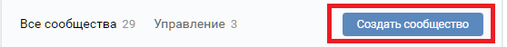
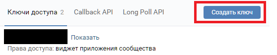
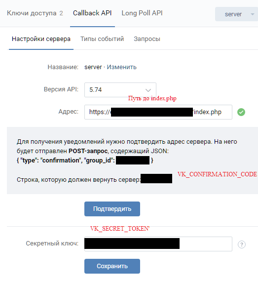

1)Создаем сообщество в vk 
 
2) Создаем токен 
Это будет VK_TOKEN 
 
3) Прописываем путь до index.php
Обязательно нужно использовать https.  
Самоподписные сертификаты не канают.
Попробуйте certbot 
 
4) git clone https://github.com/gimtonic/matematikbot.git 
composer install 
5)Cоздаем в корне файл config.php c этими константами 
VK_TOKEN - основной токен 
VK_SECRET_TOKEN - Секретный ключ 
VK_CONFIRMATION_CODE - код подтверждения  

You need to create a config.php file with the constants in the root 
VK_TOKEN - primary token 
VK_SECRET_TOKEN - Secret key 
VK_CONFIRMATION_CODE - verification code 

Если у вас возникли вопросы, обязательно напишите мне. 
Мои контакты:  
Телеграмм: @gimtonic86  
Почта: gimtonic@rambler.ru

If you have any questions, be sure to email me. 
My contacts:  
Telegrams: @ gimtonic86  
E-mail: gimtonic@rambler.ru
